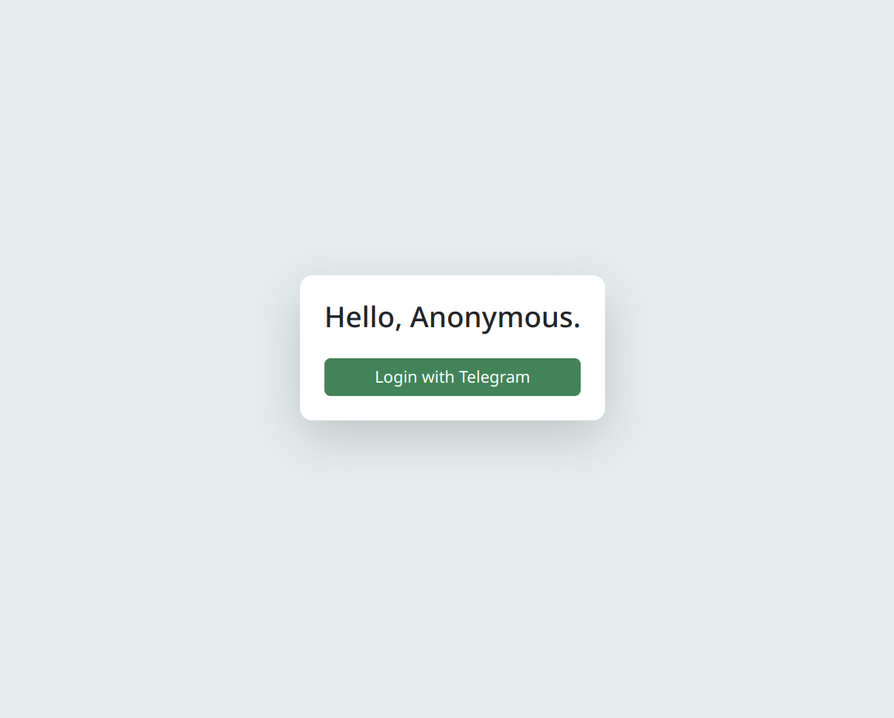

# 🚀 Telegram Login for Django App

This project enables users to **log in to a Django application via Telegram**. It uses a bot to authenticate users securely and integrates with Telegram APIs seamlessly.


---

## 🛠️ Tech Stack

- **[Django](https://www.djangoproject.com/)**: Backend framework for the application.
- **[Django Ninja](https://django-ninja.rest-framework.com/)**: Fast API integration for the application.
- **[uv](https://github.com/astral-sh/uv/)**: Python package manager.
- **[Ruff](https://github.com/astral-sh/ruff)**: Linter to enforce code quality.
- **[python-telegram-bot](https://python-telegram-bot.readthedocs.io/)**: Bot framework to handle Telegram interactions.
- **PostgreSQL**: Database for storing user and token information.

---

## 🚀 Features

- 🔑 **Login with Telegram**: Secure login using Telegram bots.
- 🐳 **Dockerized Setup**: Quickly get started with Docker Compose.
- 🧹 **Linting**: Ensure code quality using Ruff.

---

## 📦 Installation

### Prerequisites

- [Docker Compose](https://docs.docker.com/compose/)
- Telegram Bot Token (create a bot via [BotFather](https://t.me/botfather))

### Steps

1. Clone the repository:

```bash
git clone https://github.com/balancy/django_login_via_telegram.git
cd django_login_via_telegram
```

2. Copy the .env.example file to .env:

```bash
cp .env.example .env
```
3. Update the .env file with your Telegram Bot Token and other configurations.

4. Start the application:

```bash
make
Access the app at: http://127.0.0.1:8000
```

## 🧾 Environment Variables
Set the following variables in the .env file:

```env
TELEGRAM_BOT_TOKEN=digits:letters         # Your Telegram Bot Token
TELEGRAM_BOT_LINK=https://t.me/..._bot    # Telegram bot link
POSTGRES_DB=postgres                      # PostgreSQL database name
POSTGRES_PASSWORD=postgres                # PostgreSQL password
```

## 📜 Makefile Commands
### Available Commands

| Command                     | Description                          |
|-----------------------------|--------------------------------------|
| `make`                      | Builds and runs the app in development mode.  |
| `make down`                 | Stops and removes containers.                 |
| `make lint`                 | Runs the linter (Ruff) for both services.     |
| `make superuser`            | Creates a Django superuser.                   |
| `make delete-unused-tokens` | Deletes unused authentication tokens.         |

## 🛡️ Security

- This application uses Telegram's secure authentication flow for logging in users.
- Ensure you **keep your** `TELEGRAM_BOT_TOKEN` **private**.

## 🖼️ Example Bot Setup
- Open BotFather on Telegram.
- Create a new bot and get the `TELEGRAM_BOT_TOKEN`.
- Add the bot link in `.env` as `TELEGRAM_BOT_LINK`.

## 🐳 Docker Usage
- Build and start the containers:

```bash
make dev
```

- Stop and remove containers:

```bash
make down
```
